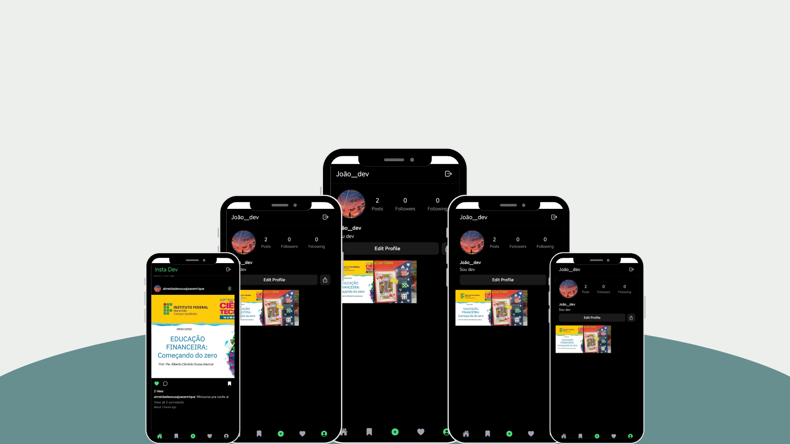
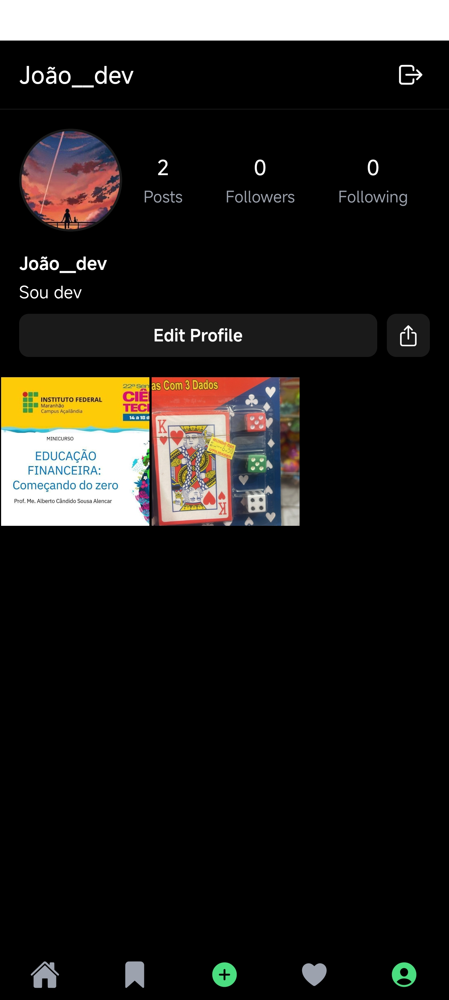
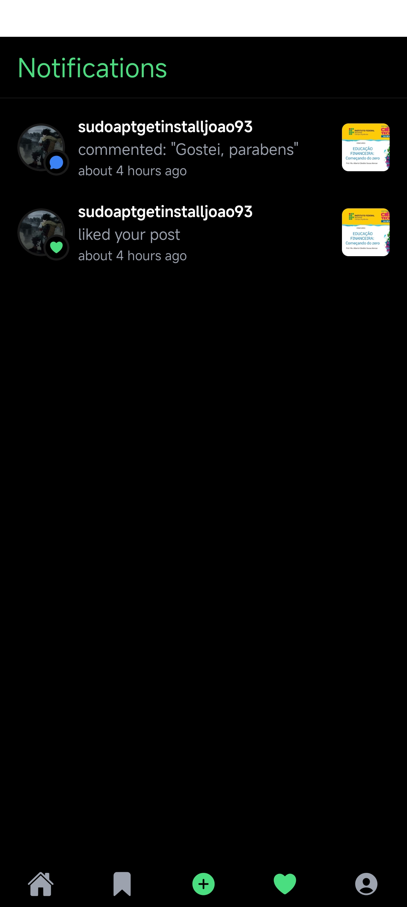

# 💼 Product Store
> Um CRUD moderno e escalável utilizando a stack PERN, estilizado com TailwindCSS e DaisyUI..

---

## 🚀 Demonstração
🔗 **Acesse o projeto:** [link-do-deploy-aqui](#)  

📸 **Preview:**  


---

## 📚 Sumário
- [Sobre o Projeto](#-sobre-o-projeto)
- [Tecnologias](#️-tecnologias)
- [Funcionalidades](#-funcionalidades)
- [Como Rodar o Projeto](#-como-rodar-o-projeto)
- [Como Usar](#-como-usar)
- [Screenshots](#️-screenshots)
- [Aprendizados](#-aprendizados)
- [Estrutura de Pastas](#-estrutura-de-pastas)
- [Roadmap](#-roadmap)
- [Links Úteis](#-links-úteis)
- [Autor](#-autor)
- [Licença](#-licença)

---

## 💡 Sobre o Projeto
Este aplucativo foi desenvolvido para **aprimorarque devs, possam se conectar e trocar informações entre si** na área de Tecnologia.  
O aplicativo foi construído com **React Native, Convex, Clerk e styles nativo**, com foco em **design moderno, responsividade e performance**.

---

## 🛠️ Tecnologias
As principais tecnologias utilizadas neste projeto foram:

- **React Native**
- **Convex** (banco de dados e autenticação)
- **Clerk** (login)
- **Style nativo** (estilizações da página)

<div align="right">
  
</div>
---

## 📚 Funcionalidades
- [x] 📸 Feed interativo — veja postagens de outros devs em tempo real
- [x] 🧠 Autenticação com Clerk — login via Google
- [x] 💬 Sistema de comentários e curtidas
- [x] 📤 Upload de imagens e posts (armazenamento no Convex)
- [x] 🕒 Sincronização instantânea — sem precisar atualizar a tela
- [x] ⚙️ Design responsivo e moderno
---

## 📦 Como Rodar o Projeto
Siga as etapas abaixo para executar o projeto localmente:

```bash
    # Crie um arquivo .env.local na raiz do projeto com as variáveis necessárias:
   EXPO_PUBLIC_CLERK_PUBLISHABLE_KEY=...
   EXPO_PUBLIC_CONVEX_URL=...
```

```bash
# Clone este repositório
git clone https://github.com/joao-enrique/Insta-dev.git

# Acesse a pasta do projeto
cd Insta-dev

# Instale as dependências
npm install
#rode a aplicação
npx expo start
```
Use o app Expo Go no celular para visualizar o projeto em tempo real 📱 (Ou abra no emulador Android/iOS.)
> 💡 Caso não tenha o Node.js instalado, procure no google e siga os passos para sua instalação.

---

## 🧪 Como Usar
1. Instale as dependências com o `node.js`.
2. Entre no app utilizando o `android studio` ou `expo go`.
3. cadastre-se no app.
4. Crie e veja postagens, número de curtidas, comentários e perfil.

---

## 🖼️ Screenshots
### 📱 tela principal

### 📱 tela de perfil

### 📱 Tela de notificações


---

## 🧠 Aprendizados
Durante o desenvolvimento deste projeto, aprimorei:
- Meus conhecimentos no `React Native`;
- Uso de Estilização nativa do react native para criação de um aplicativo responsivo;
- Uso de estados no `React`;
- Melhoria na estrutura de layout responsivo;
- Integração de `Convex` com `Clerk` para armazenar informações (posts, comentários, notificações, curtidas, usuários).

---

## 📁 Estrutura de Pastas
├── app/ </br>
├── assets/ </br>
├── components/ </br>
├── constants/ </br>
├── convex/ </br>
├── providers/ </br>
├── styles/ </br>
├── app.json </br>
└── README.md </br>
---

## 🚧 Roadmap
- [] Cadastrar-se de outras formas(sem ser apenas pelo google)
- [] Traduzir para versão em Português
- [] Opções de outros temas
---

## 🔗 Links Úteis
🌐 Deploy: [link](https://meu-portfolio-lemon-sigma.vercel.app/)  </br>
💼 LinkedIn: [link](https://www.linkedin.com/in/joao-enrique-dev/) </br>
🧠 GitHub: [link](https://github.com/joao-enrique) </br>
🎮 Itch-io: [link](https://jedev1.itch.io/) </br>
📹 YouTube: [link](https://www.youtube.com/@joaocodedev) </br>
✨ Linktree: [link](https://linktree-eight-gules.vercel.app/) </br>

## 👨‍💻 Autor
Feito com 💜 por [João Enrique](https://linktree-eight-gules.vercel.app/)
<div align="right">
  <a href="https://www.linkedin.com/in/joao-enrique-dev/" target="_blank">
    
  </a>
  <a href="https://www.youtube.com/@joaocodedev" target="_blank">
    
  </a>
  <a href="https://jedev1.itch.io/" target="_blank">
    
  </a>
</div>

---

## 📜 Licença
Este projeto está sob a licença **MIT** — veja o arquivo [LICENCE](./LICENSE) para mais detalhes.


### ⭐ Se este projeto te inspirou, não esqueça de deixar uma **estrela** no repositório!